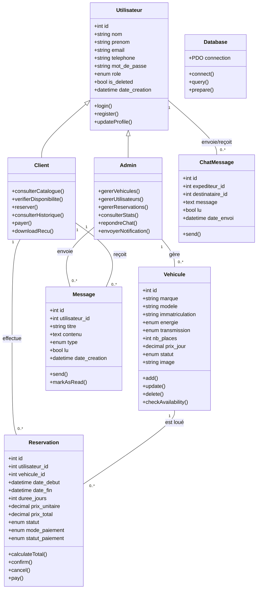

# Diagramme de Classes - AutoPartage

Ce document présente la structure statique du système AutoPartage, détaillant les entités, leurs attributs, méthodes et relations.

## 1. Modélisation Conceptuelle (Classes)

## 2. Détails des Relations
- **Héritage (Utilisateur)** : `Client` et `Admin` héritent des attributs de base de `Utilisateur` (authentification, profil).
- **Client <-> Reservation** : Relation 1 à N. Un client effectue des réservations.
- **Vehicule <-> Reservation** : Relation 1 à N. Un véhicule est loué via des réservations.
- **Admin <-> Vehicule** : L'administrateur gère (CRUD) le parc automobile.
- **Admin -> Message -> Client** : L'administrateur envoie des notifications (Message) reçues par les clients.
- **Utilisateur <-> ChatMessage** : Relation réflexive pour la messagerie instantanée entre clients et admins.

## 3. Analyse des Services (Helpers)
Le projet utilise des services transversaux non instanciés (fonctions procédurales dans `functions.php`) agissant comme des classes utilitaires :

| Service | Fonctions Clés |
| :--- | :--- |
| **AuthService** | `requireLogin()`, `requireAdmin()`, `isLoggedIn()` |
| **FormatService** | `formatPrix()`, `formatDate()`, `formatDateTime()` |
| **ValidationService** | `clean()`, `verifyCSRF()`, `vehiculeDisponible()` |
| **FinanceService** | `calculerDuree()`, `calculateTotal()` |

## 4. Cardinalités et Contraintes
- **Cardinalité [1..1]** : Une réservation doit obligatoirement être rattachée à un utilisateur et à un véhicule existant.
- **Contrainte de Statut** : Le statut d'une réservation dépend de la logique d'état (Workflow State Pattern) : `en_attente` -> `confirmee` -> `terminee`.
- **Intégrité Référentielle** : Les suppressions sont gérées par `is_deleted` (Soft Delete) pour éviter de casser les liens historiques dans la table `reservations`.
