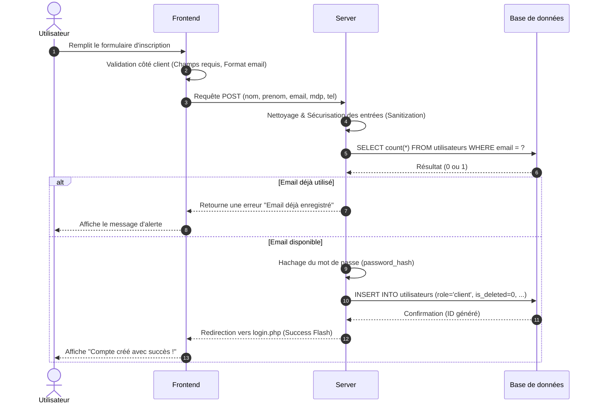
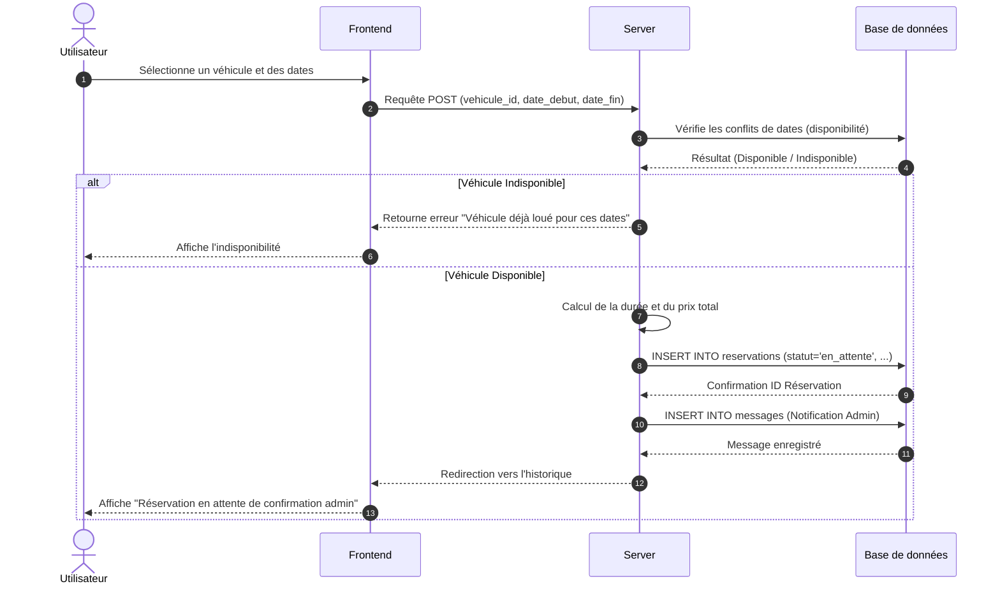
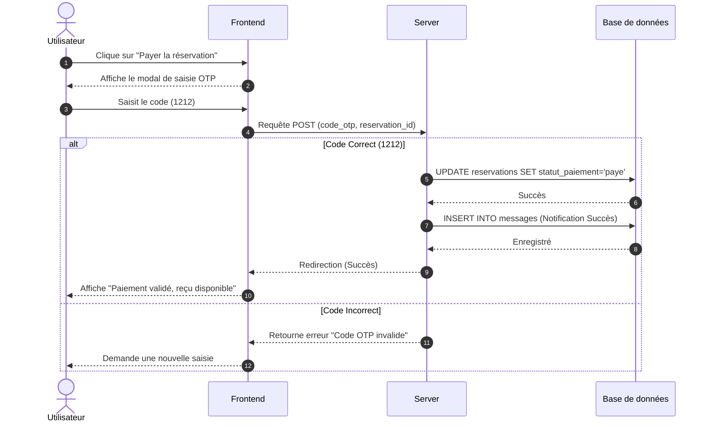
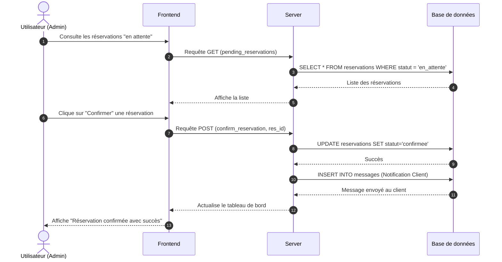

# Diagrammes de Séquence - AutoPartage

Ce document présente les flux d'interactions détaillés entre les différents composants du système AutoPartage pour les processus critiques.

---

## 1. Processus d'Inscription (S'inscrire)
Ce diagramme détaille la création d'un compte utilisateur avec validation des données et vérification d'unicité.



---

## 2. Processus de Connexion (Se connecter)
Ce diagramme illustre l'authentification sécurisée et l'initialisation de la session utilisateur.

```mermaid
sequenceDiagram
    autonumber
    actor U as Utilisateur
    participant F as Frontend
    participant S as Server
    participant B as Base de données

    U->>F: Saisit ses identifiants (Email/MDP)
    F->>S: Requête POST (login)
    
    S->>B: SELECT * FROM utilisateurs WHERE email = ? AND is_deleted = 0
    B-->>S: Données utilisateur (dont mot_de_passe haché)

    alt Utilisateur trouvé
        S->>S: Vérification du mot de passe (password_verify)
        if Mot de passe valide
            S->>S: Initialisation de la Session ($_SESSION)
            S-->>F: Redirection vers le tableau de bord
            F-->>U: Affiche l'espace personnel
        else Mot de passe invalide
            S-->>F: Retourne une erreur "Identifiants incorrects"
            F-->>U: Affiche le message d'erreur
        end
    else Utilisateur non trouvé
        S-->>F: Retourne une erreur "Identifiants incorrects"
        F-->>U: Affiche le message d'erreur
    end
```

---

## 3. Processus de Réservation (Réserver un véhicule)
Ce diagramme montre la logique de vérification de disponibilité et d'enregistrement d'une demande.



---

## 4. Processus de Paiement (Simulation OTP)
Ce diagramme détaille la validation d'un paiement sécurisé par simulation de code.



---

## 5. Processus de Confirmation Admin
Ce diagramme illustre le workflow de validation par l'administrateur.


